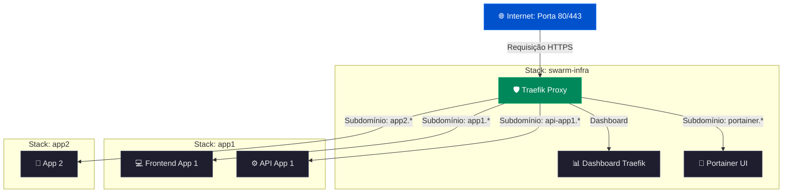

# 🐳 Swarm Infrastructure - Infraestrutura Base Compartilhada

[](https://docs.docker.com/engine/swarm/)
[](https://doc.traefik.io/traefik/)
[](https://docs.portainer.io/)

**Projeto independente** para provisionar e gerenciar a infraestrutura base de um cluster Docker Swarm compartilhada de forma profissional, segura e escalável entre múltiplas aplicações.

---

## 📦 O Que Este Projeto Fornece

*   **Traefik**: Reverse proxy e load balancer de alta performance com geração de SSL automático e gratuito (**Let's Encrypt**).
*   **Portainer**: Interface gráfica intuitiva para gerenciamento visual do cluster Swarm, stacks, serviços e volumes.
*   **Rede Compartilhada Overlay**: Uma rede interna chamada `traefik_public` que interconecta de forma segura todas as suas aplicações ao Traefik.
*   **CLI de Automação (`swarm-infra.sh`)**: Script completo em Bash para facilitar o setup, inicialização, manutenção e limpeza de toda a sua infraestrutura.

---

## 💬 Fluxo Visual de Funcionamento



---

## 🚀 Guia de Início Rápido (Passo a Passo)

Siga a sequência lógica abaixo para configurar seu servidor do zero e colocar a infraestrutura para rodar em menos de 10 minutos.

### Passo 1: Configurar Chaves SSH e Acesso ao GitHub (Recomendado)

Antes de começar, é altamente recomendado configurar o acesso ao GitHub no seu servidor. Como este projeto (e suas futuras aplicações) é gerenciado via Git, a chave SSH é a forma mais segura e prática para baixar os arquivos no seu servidor.

1.  **Gere uma nova chave SSH no terminal do seu servidor:**
    ```bash
    ssh-keygen -t ed25519 -C "seu.email@exemplo.com"
    ```
2.  **Exiba e copie a chave pública gerada:**
    ```bash
    cat ~/.ssh/id_ed25519.pub
    ```
3.  **Adicione a chave pública no seu GitHub:**
    Vá em **GitHub Settings > SSH and GPG keys > New SSH Key**, dê um título ao servidor (ex: `Production VPS`) e cole a chave no campo correspondente usando o tipo `Authentication Key`.

---

### Passo 2: Clonar o Projeto e Conceder Permissão ao Script

Com a chave SSH devidamente configurada no GitHub, clone o repositório no seu servidor VPS e conceda as devidas permissões de execução para o script administrativo.

1.  **Clone o projeto na máquina servidora** (recomenda-se no diretório `/root` ou `/home/usuario`):
    ```bash
    cd /root
    git clone git@github.com:ricardocrescenti/swarm-infra.git
    cd swarm-infra
    ```
2.  **Conceda permissão de execução ao script CLI (`swarm-infra.sh`):**
    ```bash
    chmod +x swarm-infra.sh
    ```
    > [!IMPORTANT]
    > Este comando `chmod +x` é crucial para habilitar a execução do arquivo `swarm-infra.sh`, possibilitando que você execute tanto a etapa de instalação automatizada (Passo 3) quanto as de gerenciamento subsequentes.

---

### Passo 3: Instalação do Docker e Dependências

Com o projeto já clonado localmente e o script devidamente habilitado para execução, instale o Docker e demais ferramentas de suporte.

#### Opção A: Instalação Automática (Recomendado)
Execute o instalador automatizado para fazer todo o trabalho pesado por você:
```bash
./swarm-infra.sh setup
```
> [!NOTE]
> O utilitário `setup` executa todos os comandos de sistema necessários para atualizar o repositório APT, configurar a chave GPG segura do Docker, instalar os pacotes do Docker Engine/Compose, inicializar o serviço em segundo plano e instalar dependências essenciais como o gerador de hashes `apache2-utils`.

#### Opção B: Instalação Manual
Caso prefira rodar os comandos de instalação manualmente, execute a sequência abaixo no terminal do servidor:
```bash
# 1. Atualize os repositórios do apt e instale pacotes básicos
sudo apt-get update
sudo apt-get install -y ca-certificates curl gnupg

# 2. Configure a chave GPG oficial do Docker
sudo install -m 0755 -d /etc/apt/keyrings
sudo curl -fsSL https://download.docker.com/linux/ubuntu/gpg -o /etc/apt/keyrings/docker.asc
sudo chmod a+r /etc/apt/keyrings/docker.asc

# 3. Adicione o repositório oficial do Docker às fontes do APT
sudo tee /etc/apt/sources.list.d/docker.sources > /dev/null <<EOF
Types: deb
URIs: https://download.docker.com/linux/ubuntu
Suites: $(. /etc/os-release && echo "${UBUNTU_CODENAME:-$VERSION_CODENAME}")
Components: stable
Signed-By: /etc/apt/keyrings/docker.asc
EOF

# 4. Instale o Docker Engine, CLI, Containerd e Plugins do Compose
sudo apt-get update
sudo apt-get install -y docker-ce docker-ce-cli containerd.io docker-buildx-plugin docker-compose-plugin

# 5. Inicie e ative o Docker na inicialização do sistema
sudo systemctl start docker
sudo systemctl enable docker

# 6. Instale o utilitário htpasswd (apache2-utils)
sudo apt-get install -y apache2-utils
```

---

### Passo 4: Configuração de Variáveis e Inicialização do Docker Swarm

1.  **Crie e edite seu arquivo de configuração de variáveis (.env):**
    ```bash
    cp .env.example .env
    nano .env
    ```
    Edite no arquivo `.env` as seguintes chaves fundamentais:
    *   `DOMAIN`: Seu domínio base (ex: `exemplo.com`).
    *   `LETSENCRYPT_EMAIL`: Seu e-mail administrativo para registro seguro dos certificados SSL do Let's Encrypt.

2.  **Inicialize a infraestrutura básica do cluster:**
    ```bash
    ./swarm-infra.sh init
    ```
    > [!IMPORTANT]
    > **O que o comando `init` realiza?**
    > 1. Ativa o Docker Swarm no servidor (caso já não esteja ativado).
    > 2. Valida o arquivo `.env` e pergunta interativamente pelas senhas do **Traefik** e do **Portainer** se não estiverem definidas, gerando os hashes de segurança criptográficos automaticamente.
    > 3. Cria a rede overlay `traefik_public` de barramento compartilhado.
    > 4. Efetua o deploy do Traefik e Portainer utilizando o `docker-compose.yml` integrado.

---

### Passo 5: Acesso aos Painéis de Controle

Após rodar o comando `init`, aguarde cerca de 1 a 2 minutos para que os certificados SSL seguros sejam gerados e validados automaticamente. Em seguida, abra o navegador e acesse:

*   📊 **Traefik Dashboard**: `https://traefik.seu-dominio.com` *(efetue login com o usuário `admin` e a senha gerada interativamente no init)*
*   🐳 **Portainer UI**: `https://portainer.seu-dominio.com` *(cadastre sua senha de administrador master no primeiro acesso)*

---

## 🛠️ Comando da CLI de Automação (`swarm-infra.sh`)

O arquivo [swarm-infra.sh](file:///d:/Projetos/CrescentiApps/swarm-infra/swarm-infra.sh) é o seu painel de controle via terminal.

| Comando | Descrição |
| :--- | :--- |
| `chmod +x swarm-infra.sh` | Concede permissão de execução ao script. |
| `./swarm-infra.sh setup` | Instala automaticamente o Docker, Compose e apache2-utils no servidor atual. |
| `./swarm-infra.sh init` | Ativa o Swarm, cria as redes overlay, gera as credenciais e executa o primeiro deploy. |
| `./swarm-infra.sh start` | Inicializa/re-implanta a stack de infraestrutura. Útil para aplicar alterações de compose. |
| `./swarm-infra.sh stop` | Pausa e remove os containers da stack `swarm-infra` sem apagar os volumes de dados. |
| `./swarm-infra.sh restart` | Executa um stop seguido de um start na stack com confirmação manual. |
| `./swarm-infra.sh cleanup` | ⚠️ **Ação Destrutiva**: Para a stack, remove os volumes persistentes e apaga o `.env`. |

---

## 📦 Como Integrar Novas Aplicações na Rede

Qualquer aplicação no mesmo servidor pode usar o Traefik para roteamento de tráfego e SSL automático.

### Método 1: Helper de Automação (Recomendado)
Use o assistente embutido para guiar você na adição de um novo aplicativo:
```bash
./swarm-infra.sh add-app
```
O helper gera uma configuração estruturada e exibe as labels do Traefik prontas para colar no compose do seu app.

### Método 2: Configuração Manual
No arquivo `docker-compose.yml` da sua aplicação, conecte o serviço à rede overlay externa `traefik_public` e declare as labels de roteamento:

```yaml
version: '3.8'

services:
  meu-app-web:
    image: nginx:alpine
    networks:
      - traefik_public  # <-- Conexão com a rede compartilhada
    deploy:
      replicas: 2
      labels:
        - traefik.enable=true
        
        # Define o domínio de acesso (substitua pelo seu subdomínio e domínio base)
        - traefik.http.routers.meu-app.rule=Host(`meu-app.seu-dominio.com`)
        
        # Configura as portas e entrypoints seguros (HTTPS)
        - traefik.http.routers.meu-app.entrypoints=websecure
        - traefik.http.routers.meu-app.tls.certresolver=letsencrypt
        
        # Porta interna do container que o Traefik deve enviar as requisições
        - traefik.http.services.meu-app.loadbalancer.server.port=80

networks:
  traefik_public:
    external: true  # <-- Indica que a rede foi criada pelo swarm-infra
```

Para fazer o deploy da sua aplicação, rode:
```bash
docker stack deploy -c docker-compose.yml minha-stack-app
```

---

## 💡 Padrões Comuns de Configuração de Apps

### Frontend SPA (React, Vue, Angular, HTML Estático)
Envie as conexões seguras direto para a porta interna 80:
```yaml
- traefik.http.routers.frontend.rule=Host(`app.seu-dominio.com`)
- traefik.http.routers.frontend.entrypoints=websecure
- traefik.http.routers.frontend.tls.certresolver=letsencrypt
- traefik.http.services.frontend.loadbalancer.server.port=80
```

### API Backend (Node.js, Python, Go, Java)
Encaminhe as conexões para a porta em que a API está escutando (ex: `3000`):
```yaml
- traefik.http.routers.api.rule=Host(`api.seu-dominio.com`)
- traefik.http.routers.api.entrypoints=websecure
- traefik.http.routers.api.tls.certresolver=letsencrypt
- traefik.http.services.api.loadbalancer.server.port=3000
```

### Middleware de Cabeçalhos CORS
Adicione headers de CORS diretamente na borda com o Traefik antes da requisição tocar o backend:
```yaml
- traefik.http.routers.api.middlewares=cors
- traefik.http.middlewares.cors.headers.accesscontrolallowmethods=GET,POST,PUT,DELETE,OPTIONS
- traefik.http.middlewares.cors.headers.accesscontrolalloworiginlist=https://app.seu-dominio.com
```

---

## 🎯 Casos de Uso Comuns

### Cenário A: Múltiplos Apps Compartilhando o Mesmo Servidor
Graças ao Traefik mapeando domínios/subdomínios, você pode rodar quantos aplicativos quiser no mesmo servidor dividindo a mesma porta 80 e 443!
*   `api-app1.seudominio.com` ➔ Envia tráfego seguro para o container da API 1 (porta `3000`)
*   `app1.seudominio.com` ➔ Envia tráfego seguro para o container do Frontend 1 (porta `80`)
*   `app2.seudominio.com` ➔ Envia tráfego seguro para o container da App 2 (porta `8080`)

### Cenário B: Múltiplos Ambientes (Dev, Staging, Prod)
Você pode rodar múltiplos ambientes em paralelo apontando subdomínios diferentes para stacks isoladas no mesmo cluster:
*   `dev.app.com` ➔ Direciona para a stack `app-dev`
*   `staging.app.com` ➔ Direciona para a stack `app-staging`
*   `app.com` ➔ Direciona para a stack `app-prod`

---

## 📁 Estrutura de Diretórios do Projeto

```
swarm-infra/
├── README.md                      # Este manual completo e unificado
├── .env.example                   # Modelo padrão de variáveis de ambiente
├── .env                          # Variáveis de ambiente locais (não versionado)
├── docker-compose.yml            # Definição das stacks do Traefik + Portainer
├── swarm-infra.sh                # Script de automação (CLI)
├── data/
│   └── apps/                      # Configurações JSON geradas via add-app
└── docs/
    ├── traefik-labels.md         # Documentação de referência das labels
    └── troubleshooting.md        # Documentação estendida de erros comuns
```

---

## 🔐 Detalhes de Segurança

### Proteção do Painel do Traefik
O Dashboard do Traefik é protegido com Autenticação Básica HTTP (Basic Auth). Caso queira alterar a senha de acesso manualmente fora do assistente de setup:
1.  Gere um hash da senha utilizando a ferramenta `htpasswd` instalada na máquina:
    ```bash
    echo $(htpasswd -nbB admin sua-nova-senha)
    ```
2.  Copie o resultado e cole na variável `TRAEFIK_AUTH` no arquivo `.env`. 
    *Nota: Lembre-se de duplicar os caracteres de cifrão (`$`) para `$$` para evitar conflito com variáveis do compose.*

---

## ⚠️ Diagnóstico de Problemas (Troubleshooting)

Se a sua aplicação não estiver acessível, verifique os seguintes itens nesta ordem:

1.  **Propagação de DNS**: O subdomínio desejado está apontado corretamente para o IP do seu servidor? Rode `nslookup app.seu-dominio.com` para testar.
2.  **Firewall do Servidor**: As portas HTTP (`80`) e HTTPS (`443`) estão abertas para conexões de entrada no seu provedor de nuvem (ex: AWS, DigitalOcean, Hetzner)?
3.  **Habilitação do Traefik**: O serviço correspondente no compose possui a label `- traefik.enable=true` declarada?
4.  **Conexão de Rede**: O serviço e o Traefik estão de fato na mesma rede overlay? O serviço deve declarar `traefik_public` nas suas redes.
5.  **Mapeamento de Porta**: A label `loadbalancer.server.port` aponta para a porta correta em que seu container web escuta internamente?
6.  **Atraso na Emissão do SSL**: Os certificados Let's Encrypt podem levar de 1 a 2 minutos para serem processados e ativados no primeiro deploy. Veja os logs em tempo real para verificar se há erros de SSL:
    ```bash
    docker service logs -f swarm-infra_traefik
    ```

Para soluções avançadas e outros problemas, consulte a documentação detalhada em [docs/troubleshooting.md](file:///d:/Projetos/CrescentiApps/swarm-infra/docs/troubleshooting.md).

---
*Desenvolvido de forma modular e independente - CrescentiApps.*
